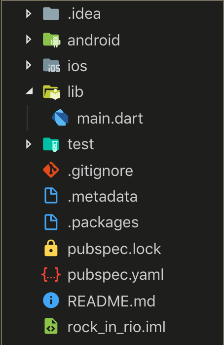
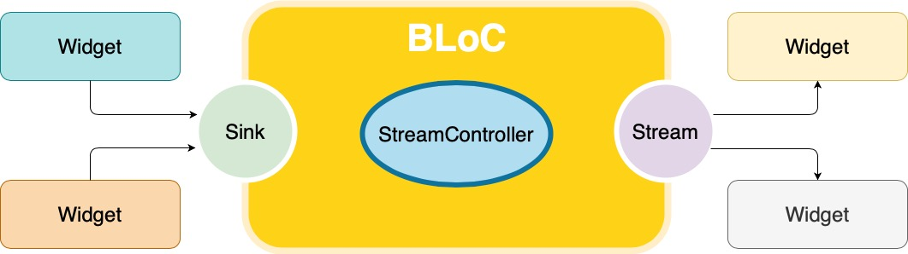
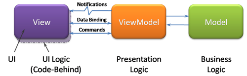

## Flutter simple guide

### Dart

* Optional types of vars.
  + Ex: 

```dart
  String name = 'Voyager I';
  int year = 1977;
  double antennaDiameter = 3.7;
  List<String> flybyObjects = ['Jupiter', 'Saturn', 'Uranus', 'Neptune'];
  Map<String, String> image = {
    'tags': ['saturn'],
    'url': '//path/to/saturn.jpg'
  };
```

* Mordern (generics<T>, functions, interfaces e mixins).
* High Order Functions ( forEach(), map(), etc ).
* Use sintax C-style (like C#, Javascript).
* Can be compiled and interpreted

                                     
### Installation (linux and mac)

* https://flutter.dev/docs/get-started/install/

After flutter installation, setup:

*  The flutter tool downloads platform-specific development binaries as needed: 
    - `flutter precache`
* Run the following command to see if there are any dependencies you need to install to complete the setup (for verbose output, add the -v flag): 
    - `flutter doctor`

### Chrome setup

You can test app's into  devices, emulators, or chrome browser. 
This guide using the web way, as follow https://flutter.dev/docs/get-started/web

* To create a new project with web support, run the following commands to use the latest version of the Flutter SDK from the beta channel and enable web support:
    - `flutter channel beta` or `flutter channel master`
    - `flutter upgrade`
    - `flutter config --enable-web`
    - `flutter devices`
    - Run `flutter devices` and Chrome device is enable and visible.
* Add web support to an existing app: To add web support to an existing project, run the following command in a terminal from the root project directory:
    - `flutter create .`

### Create simple example

* `flutter create myapp`
* `cd myapp`
* `flutter pub get` (install dependencies)
* `flutter run -d chrome`
When run app, the file containing main func is `hello_world\lib\main.dart` , and it contents:

``` dart
import 'package:flutter/widgets.dart';

void main() {
  runApp(
    Center(
      child: Text(
        'Hello, world!',
        textDirection: TextDirection.ltr,
      ),
    ),
  );
}
```

1. - Import widgets  packages
2. - Main method are start point `main()` .
3. - Run runApp()  whith the widget Center.
5. - Text widget.
6. - left to right

* Structure of simple apps 



### Widgets
In Flutter, widgets are combined to compose an application

- Layout: only care about positioning other widgets
  - Column
  - Row
  - Scaffold
  - Stack

- Interface: it's visible to user
  - Text
  - RaisedButton
  - Switch

#### StatelessWidget and StateFull
- Stateless
```dart 
class WidgetSemEstado extends StatelessWidget {
  @override
  Widget build(BuildContext context) {
    return FlutterLogo();
  }
}
```

- StateFull
```dart
class WidgetComEstado extends StatefulWidget {
  @override
  _WidgetComEstadoState createState() {
    return _WidgetComEstadoState();
  }
}

class _WidgetComEstadoState extends State<WidgetComEstado> {
  var _tamanho = 32.0;

  void aumentar() {
    setState(() {
      _tamanho = _tamanho + 16;
    });
  }

  void diminuir() {
    setState(() {
      _tamanho = _tamanho - 16;
    });
  }

  @override
  Widget build(BuildContext context) {
    return FlutterLogo(
      size: _tamanho,
    );
  }
}
```


### BLoC Business Logic of Component
> The goal of this library is to make it easy to separate presentation from business logic, facilitating testability and reusability.

- Is a pattern presented by Google at DartConf 2018, about code sharing between Flutter and AngularDart.

#### Stream
Definitions:
- Streams provide an asynchronous sequence of data. Data sequences include user-generated events and data read from files
- Stream is a sequence of asynchronous events to manage application state. 
- Streams are a native feature of the Dart language, that is, we can use them regardless of the platform (Flutter and AngularDart).
- You can process a stream using either await for or listen() from the Stream API.

Complete stream example:

```dart
import 'dart:async';

Future<int> sumStream(Stream<int> stream) async {
  var sum = 0;
  try {
    await for (var value in stream) {
      sum += value;
    }
  } catch (e) {
    return -1;
  }
  return sum;
}

Stream<int> countStream(int to) async* {
  for (int i = 1; i <= to; i++) {
    if (i == 4) {
      throw new Exception('Intentional exception');
    } else {
      yield i;
    }
  }
}

main() async {
  var stream = countStream(10);
  var sum = await sumStream(stream);
  print(sum); // -1
}

```

#### Events 
Events are any actions that change the state of our application. Be it the call to an API, the user logging in and even the increment of a counter.

- Events to BLoC via sink;
- BLoC set logical controller.
- Event output in stream;
- All stream listeners of BLoC are notified with new value.




* Bloc logical


* Dependencies 

``` yaml
dependencies:
  bloc: ^6.0.0
  flutter_bloc: ^6.0.0
```

* Import 

```dart 
import 'package:bloc/bloc.dart'; 
import 'package:flutter_bloc/flutter_bloc.dart'; 
```

#### Bloc: Simple, powerful and testable

* know what state our application is in at any point in time
* Record every single user interaction in our application so that we can make data-driven decisions.
* Work as efficiently as possible and reuse components both within our application and across other applications
* have many developers seamlessly working within a single code base following the same patterns and conventions.

#### Architecture


#### Layers

Using the bloc library allows us to separate our application into three layers:

* Presentation:  The presentation layer's responsibility is to figure out how to render itself based on one or more bloc states. 
In addition, it should handle user input and application lifecycle events. 
Will have to figure out what to render on the screen based on the state from the bloc layer.

* Business Logic : The business logic layer's responsibility is to respond to input from the presentation layer with new states. 
This layer can depend on one or more repositories to retrieve data needed to build up the application state.

* Data: The data layer's responsibility is to retrieve/manipulate data from one or more sources. 
This layer is the lowest level of the application and interacts with databases, network requests, and other asynchronous data sources.

  + Repository : As you can see, our repository layer can interact with multiple data providers,
   and perform transformations on the data before handing the result to the business logic Laye
  + Data Provider : The data provider will usually expose simple APIs to perform CRUD operations. 
  We might have a createData, readData, updateData, and deleteData method as part of our data layer

### MVVW

* MVVW complements BLOC layers because separate UI logic, Presentation Logic and Business Logic.

*    
* 

### State management approaches 
- Providers
- setState
- InheritedWidget & InheritedModel
- Redux
- BLoC / Rx
- MobX
- GetX

- https://flutter.dev/docs/development/data-and-backend/state-mgmt/options

### Providers

> Provider package allow app state management


### Patterns [4, 5]

### Run tests

* Open `dart_tests` folder

``` shell
    flutter test
```
If no file are provided, all test will be run.

### Web serve commands

* flutter packages pub global activate webdev
* flutter packages pub global run webdev serve

#### References

* [1] https://bloclibrary.dev/#/
* [2] https://flutter.dev/docs/development/ui/widgets
* [3] https://github.com/passsy/flutter-by-example
* [4] https://github.com/Flutterando/padroes_de_projeto/blob/master/versionamento.md
* [5] https://github.com/Flutterando/padroes_de_projeto/blob/master/nomenclatura.md
* [6] https://flutter.github.io/samples/#
* [7] https://bloclibrary.dev/#/fluttertodostutorial
* [8] https://fluttersamples.com
* [9] https://www.devmedia.com.br/entendendo-o-pattern-model-view-viewmodel-mvvm/18411
* [10]https://flutter.github.io/samples/provider_shopper.html
* [11]https://flutter.dev/docs/development/data-and-backend/state-mgmt/options
